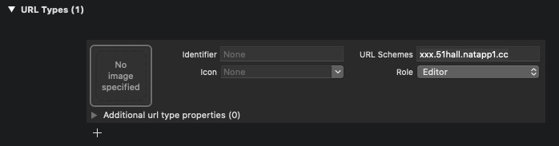

### iOS APP调用微信h5支付，及支付完跳转回APP
##### 1、info.plist里加入白名单

```xml
<key>LSApplicationQueriesSchemes</key>
<array>
  <string>wechat</string>
  <string>weixin</string>
  <string>weixinULAPI</string>
</array>
```


##### 2、添加URL Schemes

如果微信支付平台配置的支付域名为51hall.natapp1.cc，

就在支付域名前随意加个前缀作为URL Schemes

###### 例如：xxx.51hall.natapp1.cc




##### 3、wkwebview的decidePolicyForNavigationAction代理中添加处理

```objc
-(void)webView:(WKWebView *)webView decidePolicyForNavigationAction:(WKNavigationAction *)navigationAction decisionHandler:(void (^)(WKNavigationActionPolicy))decisionHandler{
    
    NSString *url = navigationAction.request.URL.absoluteString;
    if ([url containsString:@"weixin://wap/pay"]) {
        self.load = NO;
        [[UIApplication sharedApplication] openURL:navigationAction.request.URL];
        decisionHandler(WKNavigationActionPolicyCancel);
    }
    else if ([url containsString:@"https://wx.tenpay.com/cgi-bin/mmpayweb-bin/checkmweb?"] && !self.load) {
        NSURLRequest *request = navigationAction.request;
        NSMutableURLRequest *newRequest = [[NSMutableURLRequest alloc] init];
        
#pragma mark 1：改header,添加Referer
        newRequest.allHTTPHeaderFields = request.allHTTPHeaderFields;
        [newRequest setValue:@"xxx.51hall.natapp1.cc://" forHTTPHeaderField: @"Referer"];
        newRequest.URL = request.URL;
   
#pragma mark 2：拼redirect_url
        NSString *urlStr = [NSString stringWithFormat:@"%@&redirect_url=xxx.51hall.natapp1.cc://", [request.URL absoluteString]];
        newRequest.URL = [NSURL URLWithString:urlStr];
        
        [webView loadRequest:newRequest];
        self.load = YES;
        decisionHandler(WKNavigationActionPolicyCancel);
    }
    else if ([url containsString:@"https://wx.tenpay.com/cgi-bin/mmpayweb-bin/checkmweb?"]) {
        self.load = NO;
        decisionHandler(WKNavigationActionPolicyAllow);
    }else{
        decisionHandler(WKNavigationActionPolicyAllow);
    }
}
```

注意添加load属性

```objc
@property(nonatomic,assign) BOOL load;
```

注意将

```objc
[newRequest setValue:@"xxx.51hall.natapp1.cc://" forHTTPHeaderField: @"Referer"];
```

中的 xxx.51hall.natapp1.cc 换成在第2步中设置的URL Scheme;

同样将

```objc
NSString *urlStr = [NSString stringWithFormat:@"%@&redirect_url=xxx.51hall.natapp1.cc://", [request.URL absoluteString]];
```

中的 xxx.51hall.natapp1.cc 换成在第2步中设置的URL Scheme;


##### 4.禁用支付按钮长按手势，iOS11后的wkwebview如果长按会弹弹框

```objc
#pragma mark - 禁用长按 选择，长按会弹商户信息错误的弹窗
-(void)forbidCssPress{
    //禁止长按弹出 UIMenuController 相关

    //禁止选择 css 配置相关

    NSString*css = @"body{-webkit-user-select:none;-webkit-user-drag:none;}";

    //css 选中样式取消

    NSMutableString*javascript = [NSMutableString string];

    [javascript appendString:@"var style = document.createElement('style');"];

    [javascript appendString:@"style.type = 'text/css';"];

    [javascript appendFormat:@"var cssContent = document.createTextNode('%@');", css];

    [javascript appendString:@"style.appendChild(cssContent);"];

    [javascript appendString:@"document.body.appendChild(style);"];

    [javascript appendString:@"document.documentElement.style.webkitUserSelect='none';"];//禁止选择

    [javascript appendString:@"document.documentElement.style.webkitTouchCallout='none';"];//禁止长按

    //javascript 注入

    WKUserScript *noneSelectScript = [[WKUserScript alloc] initWithSource:javascript

    injectionTime:WKUserScriptInjectionTimeAtDocumentEnd

    forMainFrameOnly:YES];
    [self.wkWebView.configuration.userContentController addUserScript:noneSelectScript];

}
```

